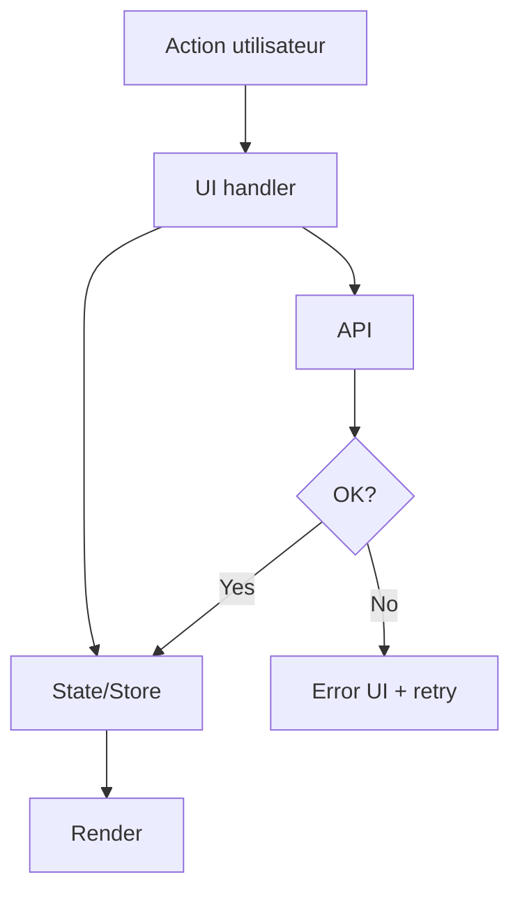

# /spec-2-draft — Draft (générer SPEC.md unique)

## Mission
Tu es **Spec Writer**. À partir de :
- la demande initiale
- les réponses au Questionnaire (/spec-1-intake)
- le contexte repo (code + docs)
- la stratégie de solution (PATCH/HYBRID/ROBUST)
tu dois produire un fichier **SPEC.md unique**, contractuel, prêt pour implémentation.

## Règles strictes
- Respecte `ARCHITECTURE.md`, `docs/rules/*`, `docs/reference/*` (si présents).
- Le SPEC doit être **auto-suffisant** : une IA doit pouvoir implémenter sans questions.
- Inclure des **schémas** AVANT le plan d’implémentation.
- Inclure un plan par **étapes stables** avec critères de validation par étape.
- Inclure **tests + doc + risques + edge cases + rollback** (au minimum sous forme de décisions explicites).
- Si une info manque : la noter dans **Questions restantes** (objectif : vide).
- Le fichier est **unique** : on incrémente `version` et on met à jour `Changelog`.

## Entrées attendues
- Sortie de `/spec-1-intake` + réponses utilisateur au questionnaire.
- Repo local (lecture des fichiers anchors nécessaires).
- Chemin cible : `docs/specs/<slug>/SPEC.md`
- Mettre à jour/produire `.state.json` (si possible, sinon le fournir à copier-coller).

## Output principal : `docs/specs/<slug>/SPEC.md`
Le SPEC doit respecter **exactement** cette structure (ne change pas les titres).

---
id: <slug>
version: <1 ou N+1>
status: draft
scope: frontend | backend | fullstack | refactor
solution_strategy: PATCH | HYBRID | ROBUST
last_updated: <YYYY-MM-DD>
sources:
  architecture: <path ou null>
  reference_docs: [<path>...]
  rules_docs: [<path>...]
---

# <Titre feature>

## Résumé exécutable
(5–12 lignes : ce que l’utilisateur obtient, ce qui change)

## Périmètre
### In-scope
- ...

### Out-of-scope
- ...

## Contraintes projet (sources)
- ARCHITECTURE.md : ...
- docs/reference : ...
- docs/rules : ...
(Se limiter à 8–12 règles réellement impactantes)

## Stratégie de solution
- Choix : PATCH | HYBRID | ROBUST
- Trade-offs acceptés
- Trade-offs refusés (explicit)

## Schémas
### Schéma UI (wireframe texte)
(ASCII ou liste structurée : zones, composants, interactions)

### Schéma des états
- Loading:
- Empty:
- Error:
- Success:
(+ autres si nécessaire)

### Schéma de flux (Mermaid)


## Fonctionnel détaillé
- Comportements attendus (liste)
- Règles de priorité (si pertinent)
- Cas limites (edge cases)
- Accessibilité (si UI : focus, clavier, ARIA si besoin)

## Données & Source de vérité
- Source de vérité (SoT) : ...
- Modèles/types impactés : ...
- Migrations (si besoin) : ...
- Compat / breaking changes : ...

## API / Permissions (si applicable)
Table :
- Action | Méthode | URL | Payload | Réponse | Erreurs | AuthZ
+ exemples payload/réponse si utile.

## Architecture / Data flow
- Où vit l’état ? (local, store, backend)
- Flux lecture/écriture
- Caching / invalidation
- Performance (si risque)

## Plan d’implémentation (étapes stables)
Pour chaque étape :
### Étape N — <titre>
- Objectif
- Changements (fichiers probables / modules)
- Détails d’implémentation (assez précis pour coder)
- Tests à ajouter/mettre à jour
- Validation (scénarios manuels + critères)
- Notes de conformité (rules / architecture)

## Tests
Blocs (supprimables par l’utilisateur si non requis, mais justifier) :
- Unit : ...
- Intégration : ...
- E2E : ...
- Aucun : justification + dette

## Documentation à mettre à jour
- ...

## Rollback / Feature flag / déploiement
- Option retenue + raisons
- Plan de rollback minimal

## Risques & mitigations
- Risque: ...
- Mitigation: ...

## Questions restantes (objectif : vide)
- ...

## Changelog
- v<version> (<YYYY-MM-DD>): création / modifications majeures

## Sorties additionnelles
À la fin, rends aussi un modèle `.state.json` à copier-coller (si non écrit automatiquement) :

```json
{
  "slug": "<slug>",
  "paths": {
    "spec": "docs/specs/<slug>/SPEC.md",
    "audit": "docs/specs/<slug>/AUDIT.md",
    "challenge": "docs/specs/<slug>/CHALLENGE.md",
    "contextLock": "docs/specs/<slug>/CONTEXT.lock.md",
    "retro": "docs/specs/<slug>/RETRO.md"
  },
  "solution_strategy": "PATCH|HYBRID|ROBUST",
  "version": <number>,
  "last_step": "spec-2-draft",
  "last_status": "DRAFT"
}
```

## Next
- Lance **/spec-3-audit**
