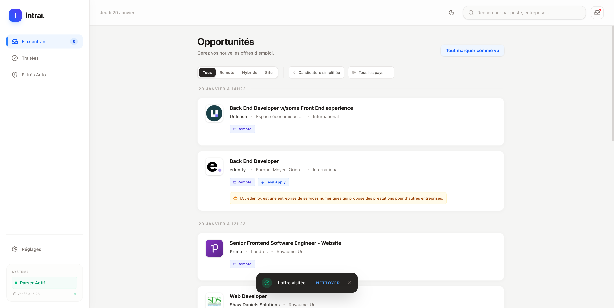

<div align="center">
  
  
  <br />
  
  <h3>An AI-powered job aggregator.</h3>
  <p>
    Centralize job offers into a single stream, triage with smart rules, and automatically filter out the noise.
  </p>
</div>

<br />

<div align="center">
  
</div>

## ✨ Core Features

-   **Single Stream Inbox**: No more juggling dozens of email alerts. All jobs are centralized in one clean interface.
-   **Smart Filtering**: Create powerful, multi-condition rules (e.g., `IF location IS NOT "Nantes" AND workMode IS "On-site" THEN filter`).
-   **Simple Triage**: Quickly decide on each offer: Save for later or move to Trash.
-   **AI Detective**: Automatically analyzes job authors to identify and help you ban recruiters or consulting agencies.
-   **Auto-Refresh**: The interface polls for new jobs every minute, keeping your inbox up-to-date automatically.
-   **Light & Dark Mode**: A sleek, modern UI that adapts to your preference.

## 🛠️ Tech Stack

-   **Framework**: [Next.js](https://nextjs.org/) (App Router)
-   **Language**: [TypeScript](https://www.typescriptlang.org/)
-   **Styling**: [Tailwind CSS](https://tailwindcss.com/)
-   **Database**: [MongoDB](https://www.mongodb.com/)
-   **Deployment**: [Vercel](https://vercel.com/) (or any Node.js environment)

## 🚀 Getting Started

### Prerequisites

-   [Node.js](https://nodejs.org/) (v18 or later)
-   `npm` or `yarn`
-   A [MongoDB](https://www.mongodb.com/try/download/community) database (local or cloud-hosted like MongoDB Atlas)

### 1. Installation

Clone the repository and install the dependencies:

```bash
git clone https://github.com/vdesbrosses/intrai.git
cd intrai
npm install
```

### 2. Environment Variables

Create a `.env.local` file in the root of the project and add the following variables.

**⚠️ Important**: Never commit this file to your repository.

```env
# .env.local

# Your MongoDB connection string.
# Example for a local instance: mongodb://localhost:27017/intrai
MONGODB_URI="YOUR_MONGO_URI"

# A secret string to secure your webhook endpoint. 
# Generate a long, random string.
WEBHOOK_SECRET="YOUR_SECRET_HERE"

# Optional: If you want to use a real AI provider for analysis.
# AI_API_KEY="sk-..."
```

### 3. Run the Development Server

You can now start the development server:

```bash
npm run dev
```

Open [http://localhost:3000](http://localhost:3000) in your browser to see the application.

## ⚙️ Ingestion Setup (CloudMailin)

`intrai` is designed to receive job offers via a webhook, typically from an email parsing service like [CloudMailin](https://www.cloudmailin.com/).

1.  **Get Your Webhook URL**: Once deployed (or using a tunneling service like `ngrok` for local development), your webhook URL will be:
    `https://<your-app-domain>/api/ingest/email?secret=<YOUR_WEBHOOK_SECRET>`

2.  **Configure CloudMailin**:
    -   Create an account on CloudMailin and get your unique email address (e.g., `your-inbox@cloudmailin.net`).
    -   Set the "Target" of this address to your webhook URL.
    -   Ensure the format is set to `JSON (Normalized)`.

3.  **Forward Your Emails**: Set up a forwarding rule in your email client (Gmail, Outlook, etc.) to automatically forward job alert emails to your CloudMailin address. Now, every new job alert will appear in `intrai` automatically!

## 📄 License

This project is licensed under the MIT License. See the [LICENSE](LICENSE) file for details.