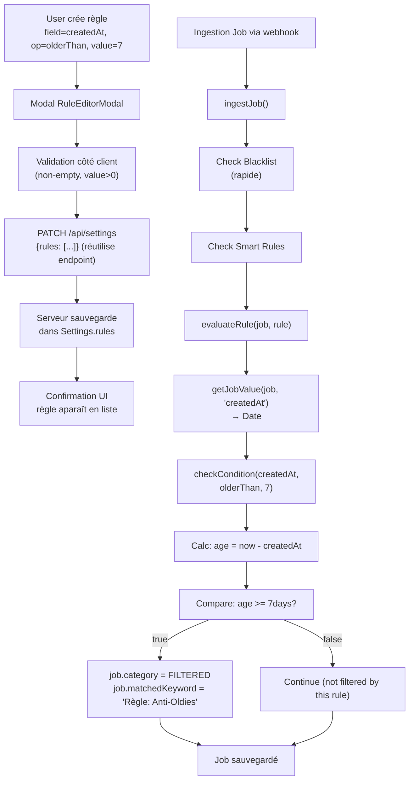

# Smart Rules — Filtre par Date de Création (createdAt)

## Résumé exécutable
Permet aux utilisateurs de créer des règles intelligentes filtrées sur la **date de création de l'offre**. 
Ex: "Filtrer les offres publiées il y a plus de 7 jours" → Les offres âgées de 7 jours ou plus sont automatiquement déplacées en **Filtrés**.
Cela étend Smart Rules (déjà implémenté) en ajoutant un champ temporel (`createdAt`) avec l'opérateur `olderThan` (support `newerThan` architecturé pour futur).
**Gain UX** : Utilisateurs peuvent maintenant combiner date + titre/location dans une même règle (ex: "Offres oldies hors Nantes").

## Périmètre

### In-scope
- Ajouter `"createdAt"` comme nouveau `RuleField` dans `lib/types.ts`
- Implémenter opérateur temporel : `"olderThan"` (valeur en jours, entier positif)
- Étendre `evaluateRule()` dans `server/rules.engine.ts` pour calculer l'âge (UTC) et comparer
- Ajouter champ input numérique dans `RuleEditorModal.tsx` (libellé: "Créé il y a...")
- Affichage lisible des conditions date dans `SettingsRules.tsx` (ex: "posté il y a plus de 7 jours")
- Unit tests + intégration tests pour logique date
- Mise à jour `docs/17_FEATURE_SMART_RULES.md` et `ARCHITECTURE.md`

### Out-of-scope
- `newerThan` (offres récentes) : v1 = `olderThan` uniquement
- Validation stricte min/max jours (accepte tout entier positif)
- Feature flag : release direct
- Support d'autres champs numériques (salary, etc.) : architecturé pour futur, mais pas implémenté
- Changement du modèle `Job` ou MongoDB
- UI calendrier complexe : simple input numérique suffit

## Contraintes projet (sources)

| Règle | Source |
|-------|--------|
| Smart Rules évaluées **côté serveur uniquement** (dans `ingestJob`) — Pas d'exécution client | ARCHITECTURE.md §Data Flow |
| `Job.createdAt` existe, fiable, est une Date MongoDB | docs/04_MODELE_DONNEES_MONGODB.md |
| Logique **ET** pour conditions (combinaison ET, pas OR) | docs/17_FEATURE_SMART_RULES.md §1.2 |
| Calcul temporel en **UTC** pour cohérence DB | Décision intake Q2 |
| Pas de regex pour dates, comparaison numérique simple | Pattern établi server/rules.engine.ts |
| Architecture ouverte à numeric types futurs (salary, etc.) | Décision intake Q10 |
| Aucune migration DB requise : `createdAt` préexiste | docs/04_MODELE_DONNEES_MONGODB.md |

## Stratégie de solution

**Choix : PATCH** (extension mineure, non-breaking)

**Justification** :
- Ajouter `createdAt` à `RuleField` et deux opérateurs est une extension naturelle
- Réutilise l'architecture Smart Rules existante (pas de refactor)
- Modifications localisées : 3 fichiers principaux + tests + docs
- Pas de migration, pas de changement API

**Trade-offs acceptés** :
- Pas de validation min/max sur les jours (simplification UX) — OK car usage interne peu risqué
- UTC uniquement (peut décaler d'une journée en local) — OK car cohérent avec MongoDB et côté serveur
- `olderThan` uniquement en v1 — OK, `newerThan` facile à ajouter si besoin

**Trade-offs refusés** :
- ❌ Support `newerThan` v1 : trop complexe pour un "filterUsage" classique (les utilisateurs veulent filtrer les "vieilles" offres)
- ❌ Feature flag v1 : release direct, rollback simple (revert 4 fichiers)

## Schémas

### Schéma UI — RuleEditorModal

```
┌─────────────────────────────────────────────────────────┐
│ [X] Nouvelle règle intelligente                          │
├─────────────────────────────────────────────────────────┤
│                                                         │
│ Nom de la règle                                         │
│ [________________]  (ex: "Anti-Oldies")                 │
│                                                         │
│ Conditions (SI...)                                      │
│ ┌─────────────────────────────────────────────────────┐ │
│ │ Si [Créé il y a▼] [olderThan▼] [7_______]  [X]     │ │
│ │                                                   │ │
│ │ Et [Titre▼]        [Contient▼] [Design____]  [X]   │ │
│ │                                                   │ │
│ │ [+ Ajouter une condition]                        │ │
│ └─────────────────────────────────────────────────────┘ │
│                                                         │
│ ALORS : Déplacer l'offre dans Filtrés                  │
│                                                         │
├─────────────────────────────────────────────────────────┤
│                                    [Annuler] [Enregistrer]│
└─────────────────────────────────────────────────────────┘
```

**Changements** :
- Nouvelle option dans `FIELD_OPTIONS` : `{ value: "createdAt", label: "Créé il y a..." }`
- Input type="number" pour la valeur (non text) quand field="createdAt"
- Opérateurs dynamiques : si field="createdAt" → afficher `["olderThan"]` seulement

### Schéma UI — SettingsRules (affichage règle)

```
┌───────────────────────────────────────────────────────┐
│ ⚡ Anti-Oldies                          [Active]      │
│                                                      │
│ SI  [Créé il y a] olderThan "7 jours"               │
│ ET  [Titre] contient "Design"                        │
│                                                      │
│ ALORS Filtrer l'annonce     [toggle] [edit] [delete]│
└───────────────────────────────────────────────────────┘
```

**Changements** :
- Affichage `olderThan` → Lire depuis un **label map** pour naturel : "posté il y a plus de {value} jours"
- Si operator est temporel, libeller le value comme "X jours"

### Schéma de flux (Mermaid)



### Schéma de données — Types

```typescript
// BEFORE (current)
export type RuleField = "title" | "company" | "location" | "workMode" | "description";
export type RuleOperator = "equals" | "not_equals" | "contains" | "not_contains" | "in" | "not_in";

// AFTER (new)
export type RuleField = 
  | "title" | "company" | "location" | "workMode" | "description"  // String
  | "createdAt";  // Date/Numeric

export type RuleOperator = 
  // String operators (unchanged)
  | "equals" | "not_equals" | "contains" | "not_contains" | "in" | "not_in"
  // Date operators (new)
  | "olderThan" | "newerThan"
  // Numeric operators (reserved for future: salary, etc.)
  // | "greaterThan" | "lessThan" | "greaterEqual" | "lessEqual"

export interface RuleCondition {
  id: string;
  field: RuleField;
  operator: RuleOperator;
  value: string | string[] | number;  // number for createdAt (days)
}
```

## Fonctionnel détaillé

### Comportements attendus

1. **Création de règle avec createdAt**
   - User sélectionne field="Créé il y a..." → operator options = `["olderThan"]` uniquement (v1)
   - User entre value = nombre entier (ex: 7, 30, 365)
   - Sauvegarde : `PATCH /api/settings` avec nouvelle règle (réutilise endpoint existant)

2. **Évaluation lors de l'ingestion**
   - Job arrive via webhook
   - Dans `ingestJob()`, si règle avec `createdAt` activée :
     - Calc: `ageInDays = Math.ceil((now - job.createdAt) / (1000 * 60 * 60 * 24))`
     - `olderThan` : vrai si `ageInDays >= value` (inclusif)
   - Si match : `job.category = "FILTERED"`, `job.matchedKeyword = "Règle: <ruleName>"`

3. **Affichage dans Settings**
   - Règle avec createdAt s'affiche : "posté il y a plus de 7 jours"
   - Toggle/Edit/Delete fonctionnent normalement

4. **Combinaison avec d'autres conditions**
   - User peut mixer createdAt + title + location dans **une même règle** (logique ET)
   - Ex: "Offres design hors Nantes AND oldies > 30j"

### Règles de priorité

- **Blacklist > Smart Rules > Whitelist** (ordre évaluation inchangé)
- Parmi les Smart Rules : ordre d'apparition (première règle match = break)

### Cas limites (edge cases)

| Cas | Comportement | Notes |
|-----|-------------|-------|
| `value = 0` | `ageInDays >= 0` → tous les jobs matchent | Edge case rare ; pas d'erreur client |
| Offre créée demain (future) | `ageInDays = -N` → `olderThan` faux | OK, job pas filtré |
| Job.createdAt = null | `getJobValue()` retourne null → `checkCondition()` retourne false | Sûr, ne match pas |
| value = très grand (9999) | OK, accepté, comportement juste | Pas d'erreur |
| Règle désactivée (enabled=false) | `evaluateRule()` retourne false immédiatement | inchangé |

### Accessibilité

- Input numérique : `type="number"`, `inputmode="numeric"` (mobile)
- Labels explicites : "Créé il y a (en jours)", "Nombre de jours"
- Affichage règles : texte clair, pas de symboles obscurs

## Données & Source de vérité

**Source de vérité** : MongoDB `settings` collection, `rules` array

**Modèles impactés** :
- `RuleField` (lib/types.ts)
- `RuleOperator` (lib/types.ts)
- `RuleCondition.value` : `string | string[] | number`
- Smart Rule storage : aucun changement (règle est objet JSON)
- Job schema : aucun changement (`createdAt` préexiste)

**Migrations** : Aucune requise. Rules existantes restent valides.

**Compat & breaking changes** :
- ✅ Non-breaking : ajouter champ à enum est safe pour runtime
- ✅ Règles existantes (title, company) continuent de marcher
- ✅ Old rules en DB sans `createdAt` : ignorées, aucun impact
- ⚠️ Client ancien : s'il reçoit un opérateur `olderThan` qu'il ne connaît pas → UI affiche "olderThan" (texte brut, acceptable)

## Architecture / Data flow

**Où vit l'état** :
- Règles : Backend (MongoDB `settings.rules`)
- Évaluation : Serveur (`evaluateRule()` dans `server/rules.engine.ts`)
- Cache : Aucun (Settings fetch à chaque ingest)

**Flux lecture/écriture** :
```
Écriture (User édite règle en Settings) :
  RuleEditorModal → SettingsRules.handleSaveRule()
    → PATCH /api/settings { rules: [...] }
    → server/settings.service.ts : updateSettings()
    → MongoDB upsert

Lecture (Job ingéré) :
  ingestJob() → getSettings() → server/rules.engine.ts : evaluateRule()
    → Pour chaque rule : checkCondition() avec getJobValue()
    → Si match : category=FILTERED
```

**Performance** :
- `evaluateRule()` est **O(n × m)** : n=conditions, m=opérateurs. Très rapide (< 1ms typ.)
- Pas de requête DB supplémentaire lors de l'éval (rule déjà chargée)
- Date calc (UTC, ceil) : ~0.1ms

## Plan d'implémentation (étapes stables)

### Étape 1 — Types & Enums (lib/types.ts)

**Objectif** : Étendre les types pour supporter date et opérateurs temporels.

**Changements** :
- Modifier `RuleField` type : ajouter `"createdAt"`
- Modifier `RuleOperator` type : ajouter `"olderThan"` (et comment future `"newerThan"` si Q3 était autre)
- Modifier `RuleCondition.value` : `string | string[] | number`
- Ajouter commentaire JSDoc : "Pour createdAt, value est nombre de jours (ex: 7)"

**Détails d'implémentation** :
```typescript
// lib/types.ts
export type RuleField = 
  | "title" 
  | "company" 
  | "location" 
  | "workMode" 
  | "description"
  | "createdAt";  // NEW

export type RuleOperator = 
  | "equals" | "not_equals" | "contains" | "not_contains" | "in" | "not_in"  // String
  | "olderThan";  // NEW — Date (value: number of days, >=)

export interface RuleCondition {
  id: string;
  field: RuleField;
  operator: RuleOperator;
  value: string | string[] | number;  // Support number for date
}
```

**Tests** : N/A (types)

**Validation** : Types compile sans erreur

**Conformité** : ✅ Non-breaking, extensible

---

### Étape 2 — Engine (server/rules.engine.ts)

**Objectif** : Implémenter la logique `olderThan` dans `evaluateRule()`.

**Changements** :
- Modifier `getJobValue()` : ajouter case `"createdAt"` → retourne `job.createdAt`
- Modifier `checkCondition()` : détecter operator `"olderThan"` et appliquer logique date
- Ajouter helper `calculateAgeInDays(createdAtDate: Date) : number`

**Détails d'implémentation** :
```typescript
// server/rules.engine.ts

function getJobValue(job: Partial<Job>, field: RuleCondition["field"]): string | null | undefined | Date {
  switch (field) {
    case "title":
      return job.title;
    case "company":
      return job.company;
    case "location":
      return job.location;
    case "workMode":
      return job.workMode;
    case "description":
      return job.rawString;
    case "createdAt":  // NEW
      return job.createdAt;
    default:
      return null;
  }
}

const INVALID_AGE = -1; // Signifie createdAt invalide/null

/**
 * Calcule l'âge d'une offre en jours (UTC), arrondi ceil (inclusif).
 * Exs: Créé à 23h59 aujourd'hui → 0 jours
 *      Créé hier → 1 jour
 * @returns Nombre entier >= 0, ou INVALID_AGE (-1) si invalide
 */
function calculateAgeInDays(createdAt: Date | string | null | undefined): number {
  if (!createdAt) return INVALID_AGE;
  const created = typeof createdAt === "string" ? new Date(createdAt) : createdAt;
  const now = new Date();
  const diffMs = now.getTime() - created.getTime();
  return Math.ceil(diffMs / (1000 * 60 * 60 * 24));  // Arrondir à la hausse pour inclusif
}

function checkCondition(
  jobValue: string | null | undefined | Date,
  targetValue: string | string[] | number,
  operator: RuleOperator
): boolean {
  // Cas spécial: opérateurs temporels
  if (operator === "olderThan") {
    if (!jobValue || typeof targetValue !== "number") return false;
    const ageInDays = calculateAgeInDays(jobValue);
    return ageInDays >= targetValue;  // Inclusif (>=)
  }

  // Cas string (unchanged)
  const normalizedJobValue = normalize(jobValue as string | null | undefined);
  if (Array.isArray(targetValue)) {
    const normalizedTargets = targetValue.map(t => normalize(t));
    if (operator === "in") {
      return normalizedTargets.includes(normalizedJobValue);
    }
    if (operator === "not_in") {
      return !normalizedTargets.includes(normalizedJobValue);
    }
    return false;
  }

  const normalizedTarget = normalize(targetValue as string);
  switch (operator) {
    case "equals":
      return normalizedJobValue === normalizedTarget;
    case "not_equals":
      return normalizedJobValue !== normalizedTarget;
    case "contains":
      return normalizedJobValue.includes(normalizedTarget);
    case "not_contains":
      return !normalizedJobValue.includes(normalizedTarget);
    default:
      return false;
  }
}
```

**Tests** :
- Unit test: `calculateAgeInDays()` avec dates variables
- Unit test: `checkCondition(..., "olderThan", 7)` avec jobs à différents âges
- Voir Étape 5

**Validation** :
- Scénario : Job créé il y a 10 jours, règle olderThan 7 → match ✅
- Scénario : Job créé il y a 5 jours, règle olderThan 7 → no match ✅
- Scénario : Job créé il y a 7 jours, règle olderThan 7 → match (inclusif) ✅

**Conformité** : ✅ Server-side (ARCHITECTURE.md), UTC, simple comparaison

---

### Étape 3 — UI Modal (components/RuleEditorModal.tsx)

**Objectif** : Permettre user de sélectionner createdAt et entrer nombre de jours.

**Changements** :
- Ajouter `"createdAt"` à `FIELD_OPTIONS` avec label "Créé il y a..."
- Ajouter case dans le rendu "Valeur dynamique" : si field="createdAt" → input type="number"
- Adapter `OPERATOR_OPTIONS` pour afficher opérateurs différents selon le field
  - Si field="createdAt" : afficher que `["olderThan"]` (v1)
  - Sinon : afficher string operators (unchanged)

**Détails d'implémentation** :
```typescript
// components/RuleEditorModal.tsx

const FIELD_OPTIONS: { value: RuleField; label: string }[] = [
  { value: "title", label: "Titre" },
  { value: "company", label: "Entreprise" },
  { value: "location", label: "Lieu" },
  { value: "workMode", label: "Mode de travail" },
  { value: "description", label: "Description brute" },
  { value: "createdAt", label: "Créé il y a..." },  // NEW
];

const OPERATOR_OPTIONS_STRING = [
  { value: "contains", label: "Contient" },
  { value: "not_contains", label: "Ne contient pas" },
  { value: "equals", label: "Est égal à" },
  { value: "not_equals", label: "Est différent de" },
  { value: "in", label: "Est l'un de" },
  { value: "not_in", label: "N'est pas l'un de" },
];

const OPERATOR_OPTIONS_DATE = [  // NEW
  { value: "olderThan", label: "Posté il y a plus de (jours)" },
];

// Dans la logique render:
// Quand user change le field, adapter les opérateurs disponibles
const getOperatorOptionsForField = (field: RuleField) => {
  if (field === "createdAt") {
    return OPERATOR_OPTIONS_DATE;
  }
  return OPERATOR_OPTIONS_STRING;
};

// Adapter le select d'operator pour afficher les opérateurs disponibles selon le field
{/* Opérateur — adapter selon le field */}
<select
  value={condition.operator}
  onChange={(e) =>
    updateCondition(condition.id, "operator", e.target.value)
  }
  className="w-1/4 px-2 py-2 bg-white dark:bg-slate-800 border border-slate-200 dark:border-slate-700 rounded-lg text-sm dark:text-slate-100"
>
  {getOperatorOptionsForField(condition.field).map((opt) => (
    <option key={opt.value} value={opt.value}>
      {opt.label}
    </option>
  ))}
</select>

// Dans le rendu "Valeur":
{condition.field === "createdAt" ? (
  <input
    type="number"
    inputmode="numeric"
    value={condition.value as number || ""}
    onChange={(e) =>
      updateCondition(condition.id, "value", parseInt(e.target.value) || 0)
    }
    placeholder="Ex: 7"
    min="0"
    className="w-full px-2 py-2 bg-white dark:bg-slate-800 border border-slate-200 dark:border-slate-700 rounded-lg text-sm dark:text-slate-100"
  />
) : condition.field === "workMode" ? (
  // ... existing workMode select
) : (
  // ... existing text input
)}
```

**Tests** :
- UI: Sélectionner field="Créé il y a..." → opérateurs changent vers ["olderThan"]
- UI: Saisir value=7 → enregistrement sauvegarde value comme nombre
- Voir Étape 5

**Validation** :
- Scénario : User crée règle date, rentre 7 → règle est sauvegardée { field: "createdAt", operator: "olderThan", value: 7 } ✅
- Scénario : User switch field → operators adapt ✅

**Conformité** : ✅ UI custom (no shadcn/ui)

---

### Étape 4 — UI List (components/SettingsRules.tsx)

**Objectif** : Afficher les règles createdAt de façon lisible.

**Changements** :
- Ajouter helper `formatConditionDisplay(condition: RuleCondition) : string`
  - Si operator="olderThan" → retourner `"posté il y a plus de ${value} jours"`
  - Sinon → comportement actuel (afficher [field] operator "value")

**Détails d'implémentation** :
```typescript
// components/SettingsRules.tsx

const formatConditionDisplay = (condition: RuleCondition): string => {
  if (condition.operator === "olderThan") {
    return `posté il y a plus de ${condition.value} jours`;
  }
  // Existing format
  return `[${condition.field}] ${condition.operator} "${
    Array.isArray(condition.value) ? condition.value.join(", ") : condition.value
  }"`;
};

// Dans le rendu condition:
<span className="italic">{formatConditionDisplay(c)}</span>
```

**Tests** : Voir Étape 5

**Validation** :
- Scénario : Afficher règle { field: "createdAt", operator: "olderThan", value: 7 }
  - Affichage : "posté il y a plus de 7 jours" ✅

**Conformité** : ✅ Aucun changement d'architecture

---

### Étape 5 — Tests (Unit + Intégration)

**Objectif** : Valider la logique temporelle et l'intégration.

**Changements** :
- Créer `server/__tests__/rules.engine.test.ts` (Vitest)
- Ajouter tests pour `calculateAgeInDays()` et `checkCondition()` avec createdAt

**Détails d'implémentation** :

```typescript
// server/__tests__/rules.engine.test.ts
import { describe, it, expect, beforeEach, afterEach, vi } from "vitest";
import { evaluateRule } from "@/server/rules.engine";
import { Job, SmartRule } from "@/lib/types";

describe("rules.engine — createdAt", () => {
  beforeEach(() => {
    // Mock date for consistent testing
    vi.useFakeTimers();
    vi.setSystemTime(new Date("2026-06-16"));
  });

  afterEach(() => {
    vi.useRealTimers();
  });

  describe("olderThan operator", () => {
    it("should match jobs older than threshold", () => {
      const job: Partial<Job> = {
        createdAt: new Date("2026-06-09"), // 7 days ago
      };
      const rule: SmartRule = {
        id: "rule1",
        name: "Anti-Oldies",
        enabled: true,
        conditions: [
          {
            id: "cond1",
            field: "createdAt",
            operator: "olderThan",
            value: 7,
          },
        ],
        action: "FILTER",
      };
      expect(evaluateRule(job, rule)).toBe(true);
    });

    it("should not match jobs newer than threshold", () => {
      const job: Partial<Job> = {
        createdAt: new Date("2026-06-12"), // 4 days ago
      };
      const rule: SmartRule = {
        id: "rule1",
        name: "Anti-Oldies",
        enabled: true,
        conditions: [
          {
            id: "cond1",
            field: "createdAt",
            operator: "olderThan",
            value: 7,
          },
        ],
        action: "FILTER",
      };
      expect(evaluateRule(job, rule)).toBe(false);
    });

    it("should match jobs at exact threshold (inclusive)", () => {
      const job: Partial<Job> = {
        createdAt: new Date("2026-06-09"), // exactly 7 days ago
      };
      const rule: SmartRule = {
        id: "rule1",
        name: "Anti-Oldies",
        enabled: true,
        conditions: [
          {
            id: "cond1",
            field: "createdAt",
            operator: "olderThan",
            value: 7,
          },
        ],
        action: "FILTER",
      };
      expect(evaluateRule(job, rule)).toBe(true);
    });

    it("should not match if createdAt is null", () => {
      const job: Partial<Job> = {
        createdAt: null as any,
      };
      const rule: SmartRule = {
        id: "rule1",
        name: "Anti-Oldies",
        enabled: true,
        conditions: [
          {
            id: "cond1",
            field: "createdAt",
            operator: "olderThan",
            value: 7,
          },
        ],
        action: "FILTER",
      };
      expect(evaluateRule(job, rule)).toBe(false);
    });

    it("should combine createdAt with other string conditions (AND logic)", () => {
      const job: Partial<Job> = {
        title: "Senior Designer",
        createdAt: new Date("2026-06-09"), // 7 days old
      };
      const rule: SmartRule = {
        id: "rule1",
        name: "Anti-Old-Designers",
        enabled: true,
        conditions: [
          {
            id: "cond1",
            field: "createdAt",
            operator: "olderThan",
            value: 7,
          },
          {
            id: "cond2",
            field: "title",
            operator: "contains",
            value: "Designer",
          },
        ],
        action: "FILTER",
      };
      expect(evaluateRule(job, rule)).toBe(true);
    });

    it("should fail combined rule if one condition fails", () => {
      const job: Partial<Job> = {
        title: "Senior Engineer", // Does not contain "Designer"
        createdAt: new Date("2026-06-09"), // 7 days old
      };
      const rule: SmartRule = {
        id: "rule1",
        name: "Anti-Old-Designers",
        enabled: true,
        conditions: [
          {
            id: "cond1",
            field: "createdAt",
            operator: "olderThan",
            value: 7,
          },
          {
            id: "cond2",
            field: "title",
            operator: "contains",
            value: "Designer",
          },
        ],
        action: "FILTER",
      };
      expect(evaluateRule(job, rule)).toBe(false);
    });
  });

  describe("disabled rules", () => {
    it("should not match disabled rules", () => {
      const job: Partial<Job> = {
        createdAt: new Date("2026-06-09"),
      };
      const rule: SmartRule = {
        id: "rule1",
        name: "Anti-Oldies",
        enabled: false, // DISABLED
        conditions: [
          {
            id: "cond1",
            field: "createdAt",
            operator: "olderThan",
            value: 7,
          },
        ],
        action: "FILTER",
      };
      expect(evaluateRule(job, rule)).toBe(false);
    });
  });
});
```

**Intégration test** (supposé utiliser DB réelle ou mock intégration Vitest) : Dans `server/__tests__/jobs.service.test.ts`, ajouter :
```typescript
it("should filter jobs older than 7 days via smart rule", async () => {
  // Setup: Create a setting with a date rule
  await settings.updateSettings({
    rules: [
      {
        id: "rule1",
        name: "Anti-Oldies",
        enabled: true,
        conditions: [
          { id: "c1", field: "createdAt", operator: "olderThan", value: 7 }
        ],
        action: "FILTER",
      }
    ],
  });
  
  // Ingest an old job
  const oldJob = {
    title: "Test",
    url: "https://example.com/1",
    createdAt: new Date(Date.now() - 10 * 24 * 60 * 60 * 1000), // 10 days old
  };
  await ingestJob(oldJob);
  
  // Verify it's filtered
  const result = await jobs.findOne({ url: oldJob.url });
  expect(result.category).toBe("FILTERED");
  expect(result.matchedKeyword).toContain("Anti-Oldies");
});
```

**Validation** : All tests pass ✅

**Conformité** : ✅ Vitest (package.json)

---

### Étape 6 — Documentation

**Objectif** : Mettre à jour docs existantes.

**Changements** :

1. **docs/17_FEATURE_SMART_RULES.md** : Ajouter section après §6

```markdown
## 7. Support des Champs Temporels (v1.1)

### Nouvelle capacité
Règles peuvent désormais filtrer sur la **date de création** des offres.

**Exemple** : "Filtrer les offres publiées il y a plus de 7 jours"

### Implémentation
- Nouveau field : `"createdAt"` (Date MongoDB)
- Opérateur : `"olderThan"` (inclusif, en jours)
- Architecture : Calcul côté serveur (UTC), aucune migration DB
- Types : `RuleField` étendu, `RuleOperator` étendu, `RuleCondition.value` supporte `number`

### Détails techniques
- Calcul d'âge : `Math.ceil((now - createdAt) / (1000*60*60*24))`
- Timezone : UTC (cohérent avec MongoDB)
- Opérateur futur : `"newerThan"` (offres récentes) — facile à ajouter

### UX
- Modal : Field "Créé il y a...", input numérique (jours)
- Display : "posté il y a plus de 7 jours"
```

2. **ARCHITECTURE.md** : Ajouter dans §Data Flow

```markdown
### Smart Rules — Field Types

Règles supportent deux catégories de fields :

1. **String fields** : title, company, location, workMode, description
   - Opérateurs : contains, not_contains, equals, not_equals, in, not_in
   - Normalisation : lowercase, trim, accents
   
2. **Numeric/Temporal fields** : createdAt, (future: salary)
   - Opérateurs : olderThan, newerThan (date) ; greaterThan, lessThan (numeric)
   - Validation : Aucune côté client ; données vérifiées côté serveur
```

**Tests** : ✅ Docs lisibles et complètes

**Validation** : Contenu cohérent avec code

---

### Étape 7 — QA Manuelle

**Objectif** : Valider UX et comportements end-to-end.

**Scénarios** :

1. Créer règle createdAt olderThan 7 → Affichage "posté il y a plus de 7 jours" ✅
2. Ingérer job vieux de 10j → Filtré automatiquement ✅
3. Ingérer job vieux de 5j → Pas filtré ✅
4. Combiner createdAt + title + location dans une règle → AND logic ok ✅
5. Toggle règle disabled → Stop filtering ✅
6. Edit règle (changer 7 → 14) → Comportement updated ✅

---

## Tests

### Unit Tests
- ✅ Logique date : `calculateAgeInDays()`, comparaison `olderThan`
- ✅ Integration : `evaluateRule()` avec createdAt + autres conditions
- ✅ Edge cases : null createdAt, future date, exact threshold

**Framework** : Vitest (déjà dans package.json)

**Couverture** :
- `server/rules.engine.ts` : new code branches
- Pas de couverture UI (Playwright optionnel, voir ci-dessous)

### E2E Tests
- ✅ (Optionnel) Playwright : Créer règle date dans Settings, vérifier UI affichage
- Ou manuel via `/settings` UI

### Aucun test
- ⊘ Components (React, modal, list) : Tests manuels en UI suffisent (Vitest + RTL trop verbeux pour cette UI)

---

## Documentation à mettre à jour

1. **docs/17_FEATURE_SMART_RULES.md** — Section §7 (voir Étape 6)
2. **ARCHITECTURE.md** — §Data Flow (voir Étape 6)
3. **lib/types.ts** — JSDoc sur `RuleField` + `RuleOperator`

**Pas à mettre à jour** :
- ⊘ docs/04_MODELE_DONNEES_MONGODB.md (createdAt déjà documenté)
- ⊘ Changelog project (au discretion utilisateur)

---

## Rollback / Feature flag / Déploiement

**Option retenue : Rollback direct (pas de feature flag)**

**Raison** :
- Feature est extension mineure, non-breaking
- Rollback simple : revert 4 fichiers (types.ts, engine.ts, Modal.tsx, SettingsRules.tsx) + 1 docs
- Pas de data migration requise
- Risque très bas

**Plan de rollback minimal** :
```bash
git revert <commit-hash>  # Reverts types, engine, UI, docs
# Smart Rules restent actives ; les règles date ne seront pas créables via UI
# Mais règles createdAt existantes en DB seront ignorées gracefully (checkCondition retourne false)
```

**Déploiement** :
- `npm run build` + `npm run lint`
- Deploy direct (VPS + Vercel)
- No downtime (changements server-side transparents)

---

## Risques & Mitigations

| Risque | Probability | Impact | Mitigation |
|--------|------------|--------|-----------|
| Calcul d'âge inexact (timezone) | Low | Medium | UTC timezone confirmé d'avance ; test unitaire avec fake timers |
| Job.createdAt = null pour jobs existants | Very Low | Low | Code gère null gracefully (returns false) |
| User entre value=0 ou négatif | Low | Low | No strict validation → but ageInDays >= 0 logique sûre |
| Old client reçoit opérateur "olderThan" qu'il ne connaît pas | Very Low | Low | UI affiche texte brut "olderThan", pas d'erreur |
| Combinaison date + string condition logique ET foireuse | Very Low | Medium | Tests unitaires couvrent ce cas |
| Performance : trop de calcul date lors ingest massive | Very Low | Low | Math.ceil est O(1), evaluateRule est O(n conditions), acceptable |

---

## Questions restantes (objectif : vide)

_[Aucune]_

---

## Changelog

- **v2** (2026-06-16) : Audit appliqué. 8 clarifications : imports Vitest, constante INVALID_AGE, JSDoc calculateAgeInDays, operator select plumbing, inputmode mobile, DB setup note, PATCH API correction, in/out-of-scope alignement.
- **v1** (2026-06-16) : Création. Support `createdAt` + `olderThan` dans Smart Rules, architecture pour future numeric fields, UTC timezone, tests + docs.

---

## Sorties additionnelles

### .state.json

```json
{
  "slug": "2026-06-16__smart-rules__createdAt-date-filter",
  "paths": {
    "spec": "docs/specs/2026-06-16__smart-rules__createdAt-date-filter/SPEC.md",
    "audit": "docs/specs/2026-06-16__smart-rules__createdAt-date-filter/AUDIT.md",
    "challenge": "docs/specs/2026-06-16__smart-rules__createdAt-date-filter/CHALLENGE.md",
    "contextLock": "docs/specs/2026-06-16__smart-rules__createdAt-date-filter/CONTEXT.lock.md"
  },
  "solution_strategy": "PATCH",
  "version": 1,
  "last_step": "spec-2-draft",
  "last_status": "DRAFT"
}
```

---

## Next

**Prêt pour /spec-3-audit** : Audit la spec pour ambiguïtés, risques cachés, complexité injustifiée.

